# Data Analysis Project: Gas Prices in Brazil

- The Dataset was obtained from [this link.](https://www.kaggle.com/datasets/matheusfreitag/gas-prices-in-brazil/data)

## About the Dataset
Updates:
Data is available from 2004 to May 2021.
NULL values - np.nan - are represented by -99999
ANP's official website has data until February 2022, but this dataset is organized weekly.

## Machine Learning Algorithm

Considering the prediction of Price, or other statistical measure, of Retail in terms of Distribution, this is a **supervised learning** problem. It's clear that if we were to make any kind of prediction, whether through *Machine Learning* or *Statistical Models*, we would have to remove certain highly correlated attributes.

## The Data
The National Agency of Petroleum, Natural Gas and Biofuels (ANP) provides monthly reports on prices of gas, diesel, and other fuels used in transportation across Brazil. This data carries information about the average value per liter, number of fuel stations analyzed, and other information grouped by regions and states across the country.

## Source
As mentioned before, this data is made available by ANP, and is regularly updated with new dates and information - which are found here in Portuguese.

## What can be done with this data?
How do different regions of Brazil see fuel prices change?
Within a region, which states increase their prices the most?
Which states are the cheapest (or most expensive) for different types of fuels?

I'll translate the Business Problem Description from Portuguese to English:

## **Business Problem Description**

**Fuel Distribution**:

Fuel distribution is the part of the fuel supply chain that involves the transportation and delivery of petroleum products, such as gasoline, diesel, natural gas, among others, from production or import locations to fueling stations and other consumption points. This stage encompasses various activities, such as transportation through pipelines, tanker trucks, ships or railways, storage in terminals, and delivery to fuel stations and industrial facilities.

**Impact on Society**:

Fuel distribution has a direct impact on society for several reasons:

1. **Accessibility and Mobility**: The efficiency of fuel distribution directly affects the availability of fuels at filling stations. Any interruption in fuel supply can affect people's mobility, goods transportation, and the economy in general.

2. **Fuel Prices**: Costs associated with distribution, such as transportation and storage, affect fuel prices. Fluctuations in distribution prices can be reflected in the prices consumers pay at filling stations.

3. **Environmental Sustainability**: Efficient distribution can reduce fuel consumption in transportation processes, minimizing greenhouse gas emissions. Additionally, fuel leaks during transportation represent significant environmental risks.

4. **Energy Security**: Reliable and continuous fuel distribution is essential to ensure a country's energy security. Any supply interruption can have serious consequences.

5. **Regulatory Compliance**: Fuel distribution must comply with strict regulations in terms of quality, safety, and environmental standards. Non-compliance with these regulations can have serious repercussions.

**Fuel Retail**:

Fuel retail is the final stage of the supply chain, involving direct sale of fuels to consumers at filling stations. Gas stations can be operated by large oil companies or independent owners.

**Impact on Society**:

Fuel retail also has an impact on society:

1. **Consumer Prices**: Filling stations set the final fuel prices for consumers. These prices can vary widely and directly affect people's transportation costs and goods transportation.

2. **Convenience and Services**: Filling stations offer additional services, such as convenience stores, restrooms, and vehicle maintenance. This affects consumer convenience and experience.

3. **Fuel Quality**: Fuel retail must ensure that offered products meet quality and safety standards. Low-quality fuels can harm vehicle performance and air quality.

4. **Competition and Consumer Choice**: Competition between filling stations affects consumer choice. The presence of various options allows consumers to compare prices and services.

In summary, fuel distribution and retail play crucial roles in ensuring access to fuels, determining consumer prices, and complying with environmental and safety regulations. These activities have a direct impact on mobility, economy, sustainability, and society's energy security. Therefore, they are of public interest and subject to strict regulation and monitoring.

## **Data Dictionary**

### START DATE: Day of Analysis;
### END DATE: Last day of weekly analysis;
### REGION: Brazilian region where data was analyzed;
### STATE: State where data was analyzed;
### PRODUCT: Fuel or gas to be analyzed;
### NUMBER OF STATIONS SURVEYED: Number of stations surveyed in the period;
### UNIT OF MEASUREMENT: Unit in which the Product was Measured;
### AVERAGE RETAIL PRICE: Average Retail Price of the Product;
### RETAIL STANDARD DEVIATION: Retail Standard Deviation of the Product;
### MINIMUM RETAIL PRICE: Minimum Retail Price of the Product;
### MAXIMUM RETAIL PRICE: Maximum Retail Price of the Product;
### AVERAGE RETAIL MARGIN: Average Retail Margin of the Product;
### RETAIL VARIATION COEFFICIENT: Retail Variation Coefficient of the Product;
### AVERAGE DISTRIBUTION PRICE: Average Distribution Price of the Product;
### DISTRIBUTION STANDARD DEVIATION: Distribution Standard Deviation of the Product;
### MINIMUM DISTRIBUTION PRICE: Minimum Distribution Price of the Product;
### MAXIMUM DISTRIBUTION PRICE: Maximum Distribution Price of the Product;
### DISTRIBUTION VARIATION COEFFICIENT: Distribution Variation Coefficient of the Product;

## What is Coefficient of Variation?

### The coefficient of variation (CV) is a statistical measure that expresses the relative variability of a dataset in relation to its mean. It is used to compare the dispersion of different datasets, regardless of their units of measurement. The coefficient of variation is calculated using the following formula:

## **CV = (Standard Deviation/Mean)*100**

### The coefficient of variation is especially useful when comparing the variability of datasets with different means or in different units. It provides a relative measure of dispersion, allowing for a more meaningful comparison than simply comparing raw standard deviations.

### In general terms, a low coefficient of variation indicates that the variability around the mean is small relative to the mean itself, while a high coefficient of variation suggests a greater relative dispersion of the data in relation to the mean.

I'll translate the Questions to be Answered from Portuguese to English:

## **Some Questions to be Answered:**

1. Which Brazilian Regions had the highest number of surveyed stations, on average?
2. Which Products (fuels) had the highest response during the study period?
3. How did the number of responses vary by Region, State, and Unit of Measurement?
4. How are the attributes distributed? Are there extreme values? What do these distributions resemble? How does the range of collected values vary by attribute for different units of measurement, products, regions, and states?
5. How do Distribution and Retail Prices vary, on a color map scale, for different Products (Fuels) and Units of Measurement in Brazil? Which states have the highest and lowest Prices, on average?
6. How does the Average of Surveyed Stations vary by Year for different units of measurement?
7. How does the Average Distribution and Retail Price behave by Year for different Products (Fuels)? And what about the Maximum and Minimum Distribution and Retail Price by Product?
8. How does the Average Distribution and Retail Price vary over the years for different Products (Fuels)? Is it possible to establish any mathematical relationship, such as polynomial regression, between the variation of Average Price over the years? And if we compare the price variation since 2004 (initial year of the Survey) with accumulated Inflation in the period?
9. Is it possible to visualize the data using two-dimensional graphs while maintaining as much information as possible?

## Restrictions and Conditions Respected
- The data explored in this work was obtained from Kaggle, as mentioned above, between 2004 and 2022.
- We consider that the numbers of surveyed stations, from which each statistic referring to, for example, product (fuel) or unit of measurement was computed and graphs created, are sufficient to be considered representative samples of the population.
- The results of this data Analysis are only valid for Brazilian states and cannot be extended to other countries, due to the form of the survey and conditions of the Brazilian population itself.
- Other attributes, which are not in the dataset, can considerably influence the results, such as regional and local factors, as well as political and geopolitical factors.

###

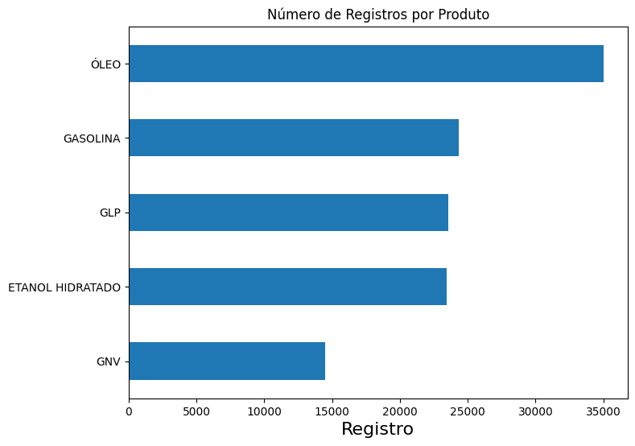

###

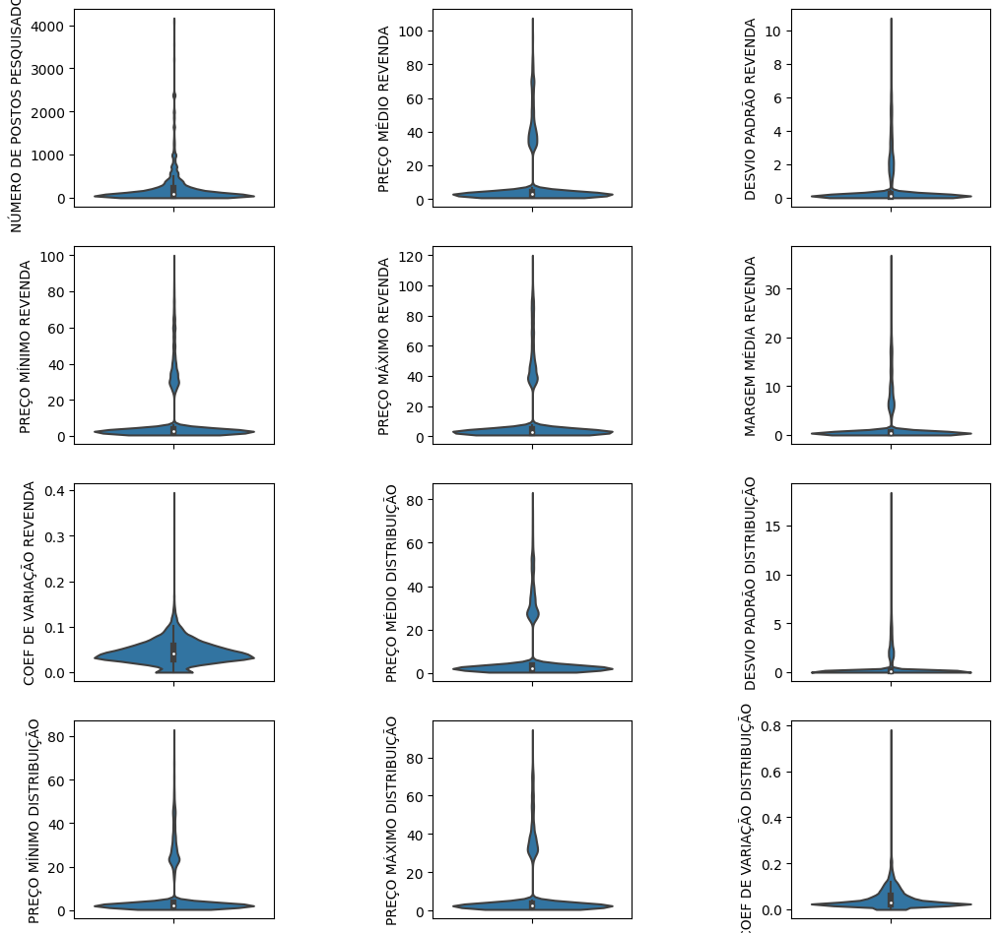

###

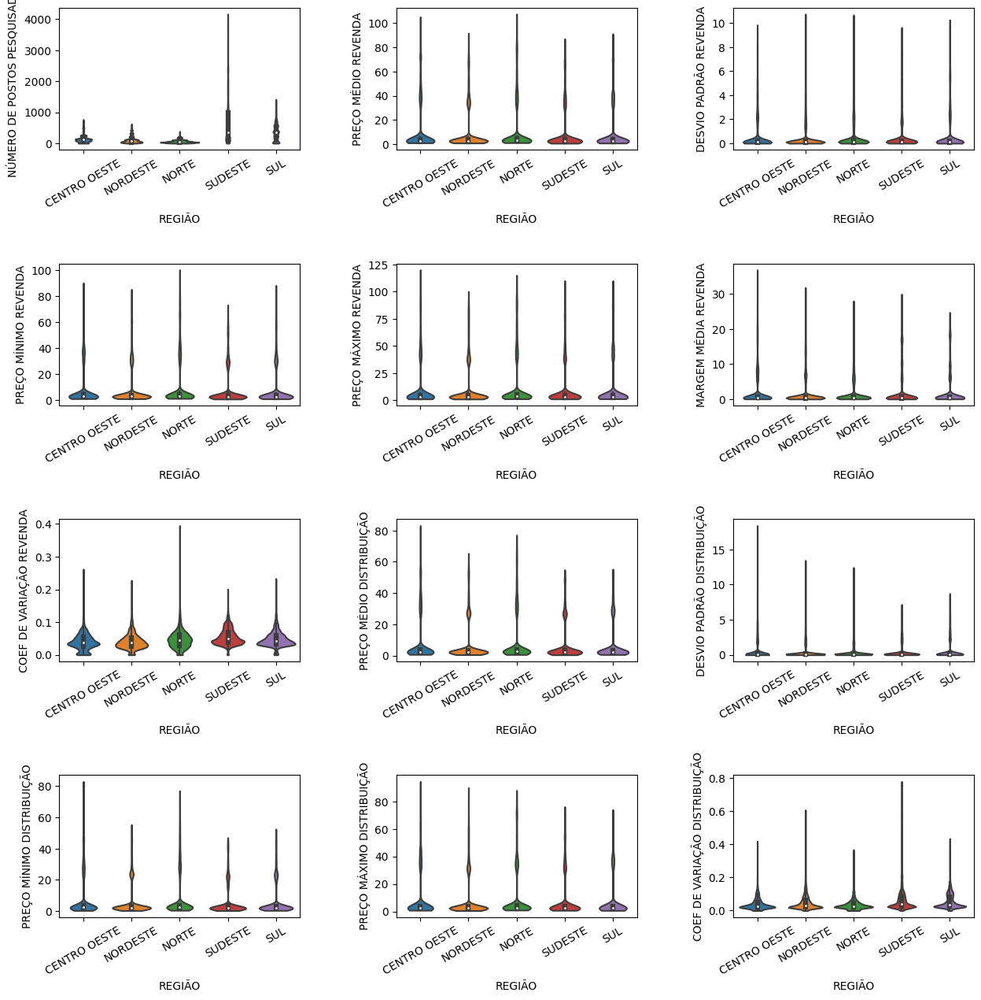

###

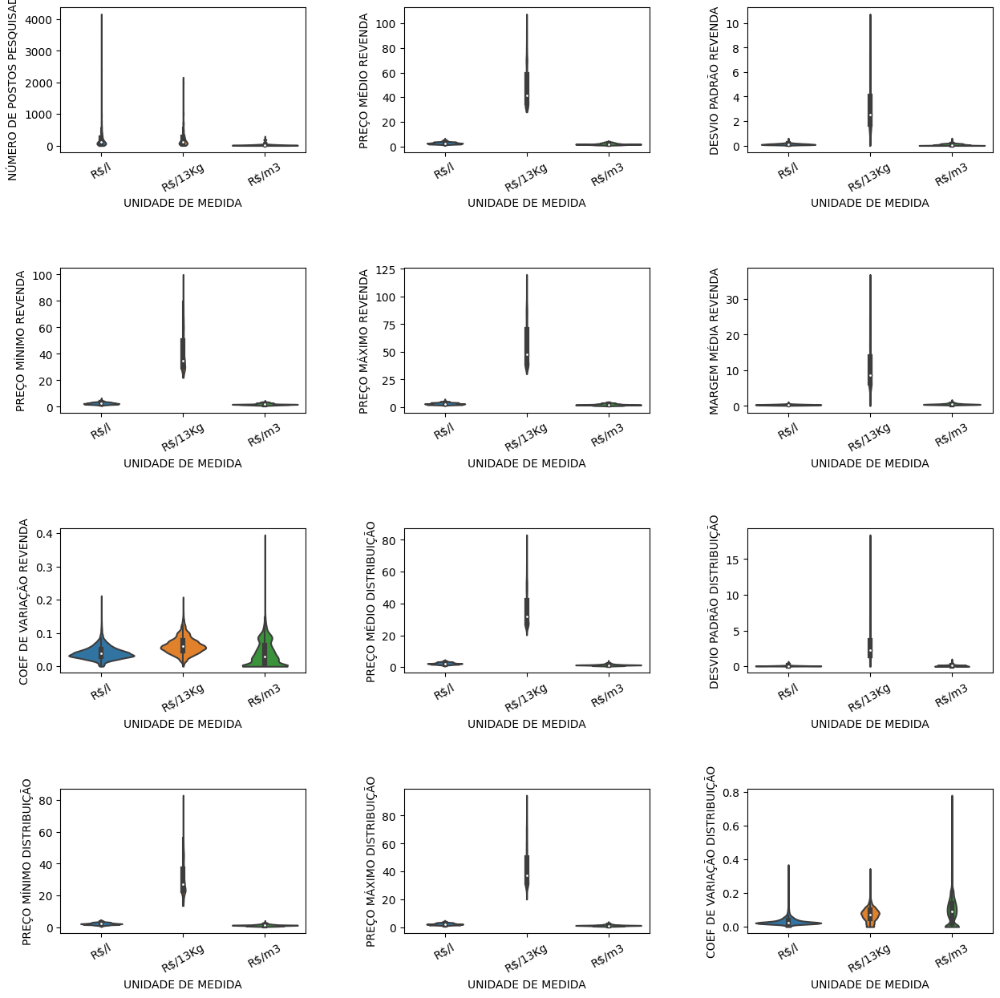

###

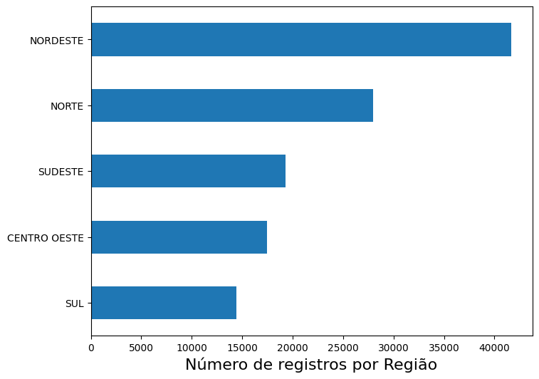

###

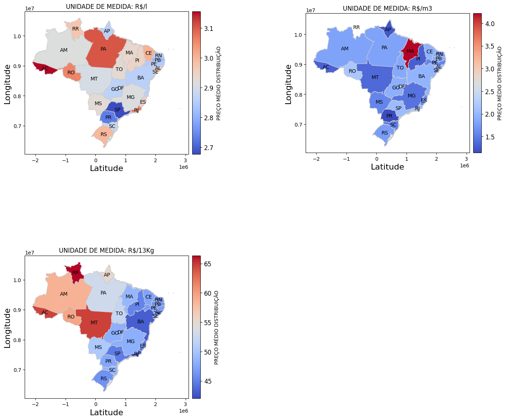

###

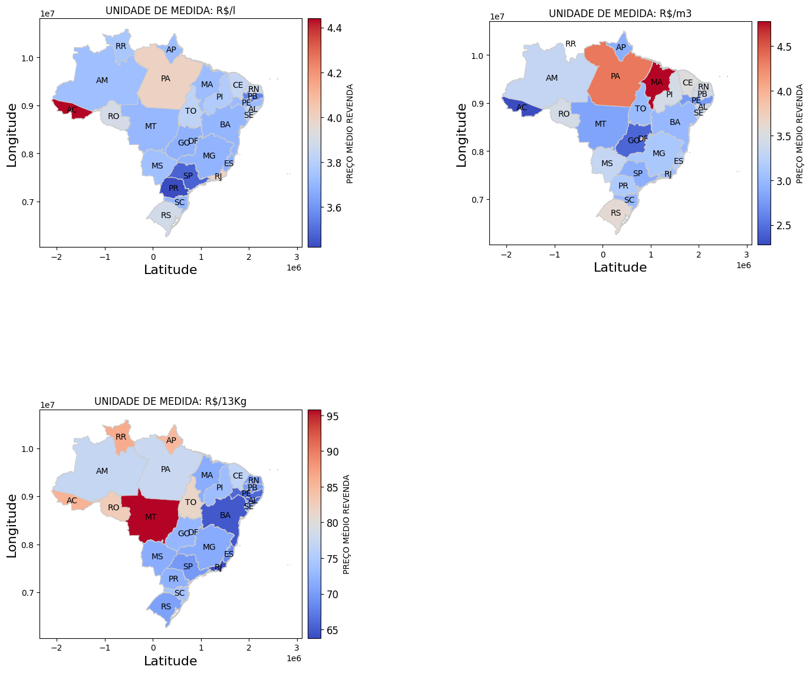

###

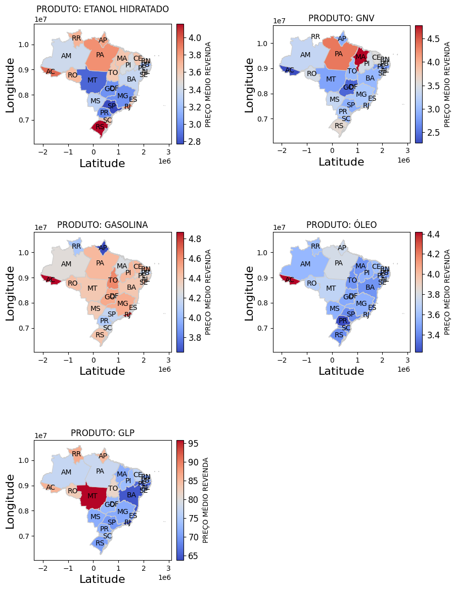

###

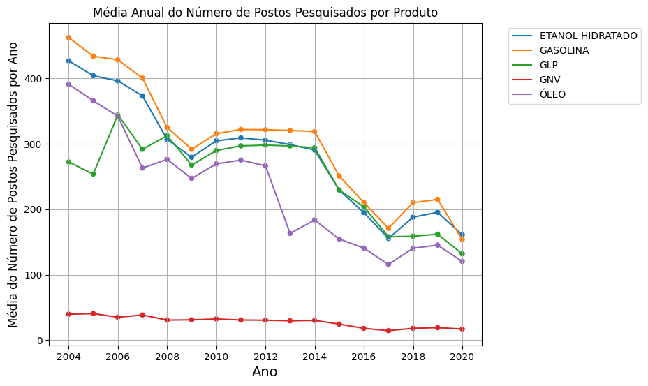

###

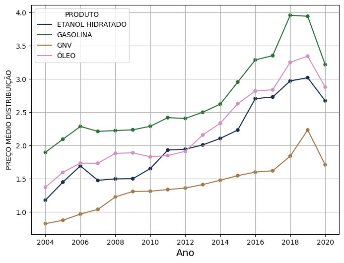

###

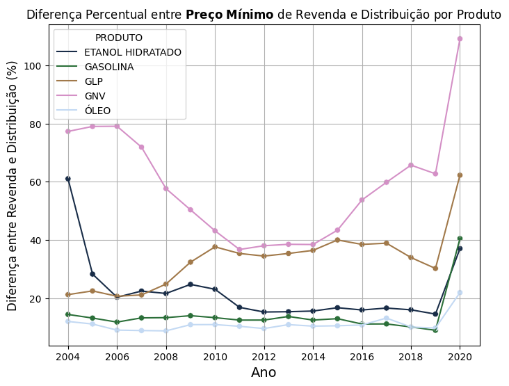

###

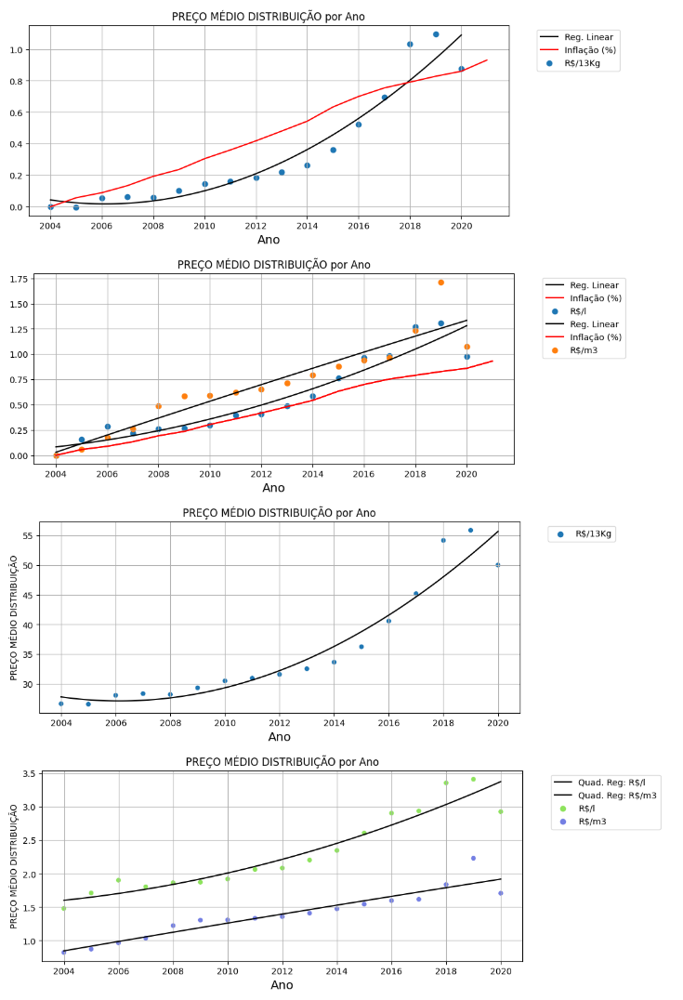

###

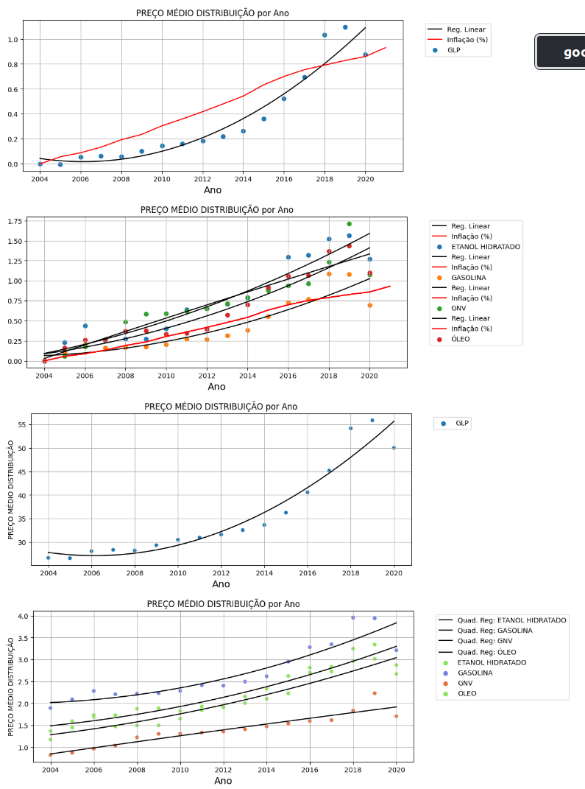

###

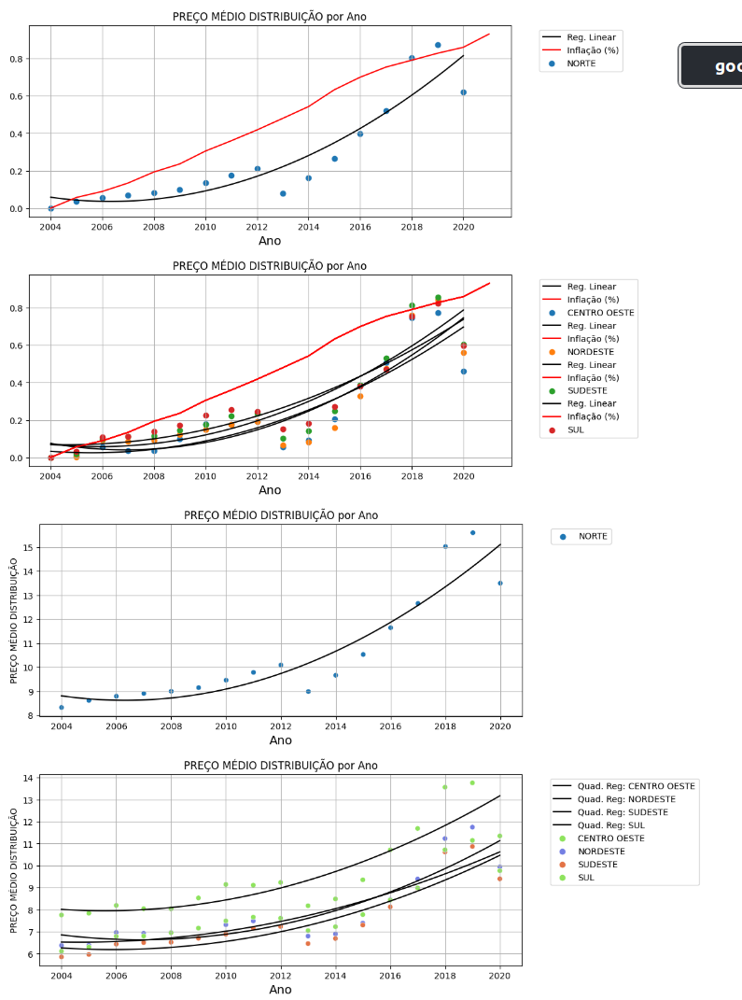

# **Partial Conclusions and Inferences**

1. Which Brazilian Regions had the highest number of surveyed stations, on average?
- Answer: They were the North and Northeast regions.
2. Which Products (fuels) had the highest response during the study period?
- Answer: They were Oil and Gasoline.
3. How did the number of responses vary by Region, State, and Unit of Measurement?
- Answer: Several states showed a high, and equal, number of responses in the survey, such as Paraíba, Santa Catarina, Rio de Janeiro, São Paulo, and Rio Grande do Sul.
4. How are the attributes distributed? Are there extreme values? What do these distributions resemble? How does the range of collected values vary by attribute for different units of measurement, products, regions, and states?
- Answer: The data distributions appear to be a mixture of Gaussian, Exponential, and Log-Normal distributions. There are many extreme values in the dataset based on a given matrix, such as unit of measurement and products (fuels). However, we did not remove such rows in the dataset, because we would be transforming it into an irregular time series.
5. How do Distribution and Retail Prices vary, on a color map scale, for different Products (Fuels) and Units of Measurement in Brazil? Which states have the highest and lowest Prices, on average?
- Answer: In general, more "distant" states, such as Acre, Roraima, and Amapá have higher Distribution and Retail Prices, while São Paulo, Rio de Janeiro, Paraná, and Bahia have lower prices.
6. How does the Average of Surveyed Stations vary by Year for different products?
- Answer: It decays in an almost linear manner over the years.
7. How does the Average Distribution and Retail Price behave by Year for different Products (Fuels)? And what about the Maximum and Minimum Distribution and Retail Price by Product?
- Answer: In general, the Average Distribution and Retail Price by Year increases in a quadratic manner over the years, a behavior also noted for Distribution and Retail for different fuels. The difference between Retail and Distribution always remains greater than 15%. Interestingly, the difference between Maximum Retail Price and Minimum Distribution Price increases rapidly over the years.
8. How does the Average Distribution and Retail Price vary over the years for different Products (Fuels)? Is it possible to establish any mathematical relationship, such as polynomial regression, between the variation of Average Price over the years? And if we compare the price variation since 2004 (initial year of the Survey) with accumulated Inflation in the period?
- Answer: The Average Distribution and Retail Price increases in a quadratic manner over the years for different Products (Fuels), and it stays below accumulated Inflation for most years for the product "R$/13kg", while for "R$/l" and "R$/m3" the Price stays above accumulated Inflation.
9. Is it possible to visualize the data using two-dimensional graphs while maintaining as much information as possible?
- Answer: We used PCA to visualize the data two-dimensionally. The first two principal components form regions where we can clearly see different values of Average Retail Price - homogeneous regions - while for components that have accumulated variance greater than about 0.9, the regions of such two-dimensional projection graphs are quite heterogeneous.

# **Future Work**

- Create a *Streamlit* application to visualize these graphs and insights on the web;
- Create *statistical models*, such as ARIMA and SARIMAX, to predict, for example, the Average Retail Price by State for a given week, in terms of Distribution attributes, conveniently excluding strongly correlated variables;
- Develop analyses in terms of moving averages, on a monthly period, and also in terms of exponential smoothing;
- Create two-dimensional visualizations of the data using the *t-SNE* technique.
- In the data normalization step, we can use **RobustScaler** as an alternative to *MinMaxScaler*, which may be more appropriate for this dataset, considering that we have many outliers. RobustScaler subtracts Q1, the first quartile, from the data and divides by the interquartile range, IQR, given by Q3-Q1.

# Contributor Covenant Code of Conduct

## Our Pledge

We as members, contributors, and leaders pledge to make participation in our
community a harassment-free experience for everyone, regardless of age, body
size, visible or invisible disability, ethnicity, sex characteristics, gender
identity and expression, level of experience, education, socio-economic status,
nationality, personal appearance, race, caste, color, religion, or sexual
identity and orientation.

We pledge to act and interact in ways that contribute to an open, welcoming,
diverse, inclusive, and healthy community.

## Our Standards

Examples of behavior that contributes to a positive environment for our
community include:

* Demonstrating empathy and kindness toward other contributions that are not aligned with this Code of Conduct, and will communicate reasons for moderation decisions when appropriate.

## Scope

This Code of Conduct applies within all community spaces, and also applies when
an individual, or aggression toward or disparagement of classes of individuals.

**Consequence**: A permanent ban from any sort of public interaction within the
community.

## Attribution

This Code of Conduct is adapted from the [Contributor Covenant][homepage],
version 2.1, available at
[https://www.contributor-covenant.org/version/2/1/code_of_conduct.html][v2.1].

Community Impact Guidelines were inspired by
[Mozilla's code of conduct enforcement ladder][Mozilla CoC].

For answers to common questions about this code of conduct, see the FAQ at
[https://www.contributor-covenant.org/faq][FAQ]. Translations are available at
[https://www.contributor-covenant.org/translations][translations].

[homepage]: https://www.contributor-covenant.org
[v2.1]: https://www.contributor-covenant.org/version/2/1/code_of_conduct.html
[Mozilla CoC]: https://github.com/mozilla/diversity
[FAQ]: https://www.contributor-covenant.org/faq
[translations]: https://www.contributor-covenant.org/translations is officially representing the community in public spaces.
Examples of representing our community include using an official e-mail address,
posting via an official social media account, or acting as an appointed
representative at an online or offline event.

## Enforcement

Instances of abusive, harassing, or otherwise unacceptable behavior may be
reported to the community leaders responsible for enforcement at
[INSERT CONTACT METHOD].
All complaints will be reviewed and investigated promptly and fairly.

All community leaders are obligated to respect the privacy and security of the
reporter of any incident.

## Enforcement Guidelines

Community leaders will follow these Community Impact Guidelines in determining
the consequences for any action they deem in violation of this Code of Conduct:

### 1. Correction

**Community Impact**: Use of inappropriate language or other behavior deemed
unprofessional or unwelcome in the community.

**Consequence**: A private, written warning from community leaders, providing
clarity around the nature of the violation and an explanation of why the
behavior was inappropriate. A public apology may be requested.

### 2. Warning

**Community Impact**: A violation through a single incident or series of
actions.

**Consequence**: A warning with consequences for continued behavior. No
interaction with the people involved, including unsolicited interaction with
those enforcing the Code of Conduct, for a specified period of time. This
includes avoiding interactions in community spaces as well as external channels
like social media. Violating these terms may lead to a temporary or permanent
ban.

### 3. Temporary Ban

**Community Impact**: A serious violation of community standards, including
sustained inappropriate behavior.

**Consequence**: A temporary ban from any sort of interaction or public
communication with the community for a specified period of time. No public or
private interaction with the people involved, including unsolicited interaction
with those enforcing the Code of Conduct, is allowed during this period.
Violating these terms may lead to a permanent ban.

### 4. Permanent Ban

**Community Impact**: Demonstrating a pattern of violation of community
standards, including sustained inappropriate behavior, harassment of an
individual people
* Being respectful of differing opinions, viewpoints, and experiences
* Giving and gracefully accepting constructive feedback
* Accepting responsibility and apologizing to those affected by our mistakes,
  and learning from the experience
* Focusing on what is best not just for us as individuals, but for the overall
  community

Examples of unacceptable behavior include:

* The use of sexualized language or imagery, and sexual attention or advances of
  any kind
* Trolling, insulting or derogatory comments, and personal or political attacks
* Public or private harassment
* Publishing others' private information, such as a physical or email address,
  without their explicit permission
* Other conduct which could reasonably be considered inappropriate in a
  professional setting

## Enforcement Responsibilities

Community leaders are responsible for clarifying and enforcing our standards of
acceptable behavior and will take appropriate and fair corrective action in
response to any behavior that they deem inappropriate, threatening, offensive,
or harmful.

Community leaders have the right and responsibility to remove, edit, or reject
comments, commits, code, wiki edits, issues, and other

